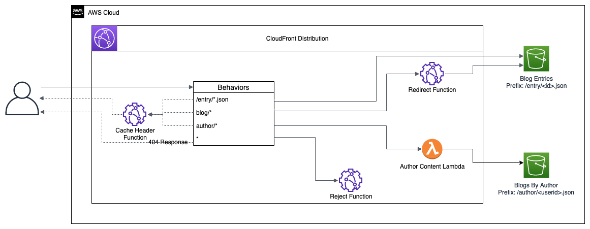

# CF Functions and Lambda at Edge APG Pattern
***

CloudFront Functions and Lambda@Edge provide mechanisms to move processing closer to your users, proving a better user experience by reducing latency.  This pattern provides examples of content distribution using these mechanisms.  Use cases include url redirection, content manipulation, and header enforcement.   


To demonstrate these use cases, we will simulate serving content for a blogging platform.  Data are organized in two forms, individual posts accessible by blog post Id as well as content aggregated by author.  A CloudFront distribution is utilized to serve this content from a S3 origin.  Content is accessible utilizing the path to objects in the S3 origin, but additional functionality is needed.  Firstly, access to the content should be available using a rest-style URL as to provide access to client apps in a standardized manner while also abstracting service of the content from underlying implementation details.  Additionally, manipulation of content based on call parameters should not require a full trip to backend systems since it has already been projected into a form suitable for content distribution.  Finally, all responses should have a standard header specifying when the content should be considered stale from a cache management standpoint.  For the purposes of url redirection and header enforcement, CloudFront functions will be used.  Lambda@Edge will be used to perform content manipulation.



***

## Deploy and Use Pattern
### Clone Repo and Deploy
```
git clone git@github.com:aws-samples/cf-functions-and-lambda-at-edge-apg-pattern.git edge-pattern && cd edge-pattern
npm install
npm run build
cd lambdas && npm install --save && cd -
cdk deploy
```
### Upload Content
Using originBucketName CDK deployment output, update ./scripts/upload-content.sh to use your bucket name.  Please note you must have valid AWS CLI access credentials configured.
```
chmod +x ./scripts/upload-content.sh
./scripts/upload-content.sh
```
Confirm content by viewing files in author and entry prefixes:
```
aws s3 ls s3://<bucketName>/author/
aws s3 ls s3://<bucketName>/entry/
```
### Demonstrate Pattern
Using distributionDomainName CDK deployment output, perform HTTP GET on the following URLs to retrieve content:
```
curl https://<distributionDomainName>/entry/1.json
curl https://<distributionDomainName>/blog/1
curl https://<distributionDomainName>/author/ktinn
curl https://<distributionDomainName>/author/ktinn?fields=blogs
```
Observe cache-control header in verbose response:
```
curl -v https://d2k1vcagwly1pw.cloudfront.net/entry/1.json
```
Observe 404 when using unsupported url:
```
curl -v https://<distributionDomainName>/giveMe404
```
### Delete Lambda@Edge Replicated Lambda Instances
In the author/* behavior in the CloudFront distribution, set Origin request to "No association"

In the lambda, click into the latest version and delete the CloudFront trigger

Give CloudFront ~1 hour to delete the copies of lambda that have been propagated
### Destroy Stack
```
cdk destory --force
```
***
## Contributing

See [CONTRIBUTING](CONTRIBUTING.md) for more information.

## Security

See [CONTRIBUTING Security Section](CONTRIBUTING.md#security-issue-notifications) for more information.

## License

This library is licensed under the MIT-0 License. See the LICENSE file.

## Authors and Acknowledgment

Thank you to [Jose Olcese](https://www.linkedin.com/in/joseolcese/) and [Daniel Kozhemyako](https://www.linkedin.com/in/kozhemyako/) for assistance.

